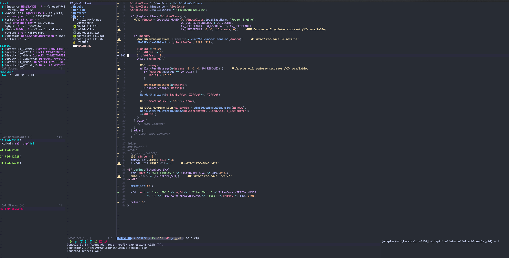

<h2 align="center">
Talis' VERY BASIC configuration with Lua
</h2>

# Table of Contents

- [Table of Contents](#table-of-contents)
- [My neovim setup](#my-neovim-setup)
- [References](#references)
- [Plugins](#plugins)
- [Requirements](#requirements)
- [LSP \& Debugging](#lsp--debugging)
  - [Python](#python)
  - [C/C++](#cc)

# My neovim setup

**IMPORTANT:** This a windows only configuration (for now) and is set for my own liking and there are still several things that I would to change in the future.
I'll keep on improving it's configuration for at least the following languages: lua, python and c/c++.

**Feel free to use/modify as you wish, at your own risk.**

# References

* [VonHeikemen](https://github.com/VonHeikemen/dotfiles/tree/master)'s dot files
* [Chris@Machine](https://www.youtube.com/@chrisatmachine)'s youtbune channel
* [Josean Martinez](https://www.youtube.com/@joseanmartinez)'s youtube channel
* [Dreams of Code](https://www.youtube.com/@dreamsofcode/featured)'s youtube channel

# Plugins

[lazy.nvim](https://github.com/folke/lazy.nvim) - Plugin manager for Neovim

[mason.nvim](https://github.com/williamboman/mason.nvim) - Package manager for LSP servers, DAP servers, linters and more

[nvim-dap](https://github.com/mfussenegger/nvim-dap) - Debug Adapter Protocol client implementation for neovim

[nvim-lspconfig](https://github.com/neovim/nvim-lspconfig) - For Neovim's built-in language server client

[nvim-cmp](https://github.com/hrsh7th/nvim-cmp) - Auto completion plugin

[LuaSnip](https://github.com/L3MON4D3/LuaSnip) - Snippet Engine for Neovim written in Lua

[nvim-tree.lua](https://github.com/kyazdani42/nvim-tree.lua) - A File Explorer written In Lua

[nvim-autopairs](https://github.com/windwp/nvim-autopairs) - A super powerful autopairs for Neovim

[gitsigns](https://github.com/lewis6991/gitsigns.nvim) - Super fast git decorations implemented purely in lua/teal

[nvim-treesitter](https://github.com/nvim-treesitter/nvim-treesitter) - Nvim Treesitter configurations and abstraction layer

[nvim-web-devicons](https://github.com/kyazdani42/nvim-web-devicons) - A Lua fork of vim-devicons

[nvim-telescope](https://github.com/nvim-telescope/telescope.nvim) - Powerful fuzzy finder for project files, text and more

[lualine.nvim](https://github.com/nvim-lualine/lualine.nvim) - Status line written in lua

[catppuccin](https://github.com/catppuccin/catppuccin) - Color theme

[null-ls.nvim](hhttps://github.com/jose-elias-alvarez/null-ls.nvim) - **This plugin is no longer in development!** Injects diagnostics and code action to neovim's LSP.

# Requirements
Run the neovim command `:checkhealth` for a full diagnose and missing dependecies.

* Python
* Clangd
* Codelldb - I'm using the vscode extentsion for simplicity sake
* Lua
* Ripgrep for faster

# LSP & Debugging
New server configurations can be added to `lua/plugins/lsp/servers.lua` it can be manually started with the command `:Lsp {server_Name}`. Alternatively, there's a variable `auto_servers` in `lua/plugins/lsp/init.lua` that can be modified with new configuration names to be auto-started.

This configuration is set to have the ability to debug the following languages:
* Python
* C/C++
## Python
Python should be simple enough to just run the current file with dap.

## C/C++
* In order to Debug a c++ project is necessary to compile and generate the debug symbols.
* Then, **for now**, it's necessary to run the codelldb server (with port=1300)
  * The command for me is:
  * `C:\\Users\\talis\\.vscode\\extensions\\vadimcn.vscode-lldb-1.9.2\\adapter\\codelldb.exe --port 13000`
* Setup your break points and start DAP by selecting the executable file.